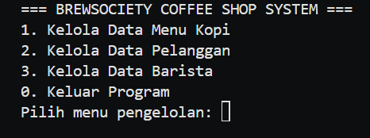

# ☕ Sistem Manajemen Coffee Shop - BrewSociety

Sistem Manajemen Coffee Shop (BrewSociety) adalah program berbasis Java (Console) yang menerapkan konsep Pemrograman Berorientasi Objek (OOP). Program ini dirancang untuk mengelola data operasional kedai kopi secara dinamis menggunakan `ArrayList`.

## Fitur Utama (CRUD)
Program ini mendukung operasi **Create, Read, Update, dan Delete (CRUD)** berjalan dalam sebuah *looping* menu utama hingga pengguna memilih untuk keluar. Sistem ini mengelola tiga entitas (Class) yang berbeda:

1. Menu Kopi (`MenuKopi`): Mengelola data minuman yang dijual (ID Menu, Nama Kopi, Harga).
2. Pelanggan (`Pelanggan`): Mengelola data pelanggan dan keanggotaan (ID Pelanggan, Nama, Status Member).
3. Barista (`Barista`): Mengelola data pegawai dan jadwal kerjanya (ID Barista, Nama, Shift Kerja).

## 🛠️ Konsep OOP yang Digunakan
Sesuai dengan Modul Praktikum (Modul 1 & Modul 2), program ini mengimplementasikan:
* *Class & Object: Pembuatan blueprint* untuk Menu, Pelanggan, dan Barista.
* *Property / Atribut*: Variabel yang mendefinisikan karakteristik dari setiap objek.
* *Method*: Fungsi `tampilkan()` pada masing-masing class untuk mencetak detail data ke layar.
* *Constructor*: Digunakan untuk menginisialisasi objek baru saat ditambahkan ke dalam `ArrayList`.

## 📸 Dokumentasi & Laporan Eksekusi Program

Berikut adalah hasil jalannya program (Screenshot):

### 1. Tampilan Menu Utama
*(Penjelasan: Menampilkan menu navigasi awal saat program baru dijalankan)*

### 2. Fitur Kelola Menu Kopi (CRUD)
*(Penjelasan: Proses saat menambahkan menu kopi baru dan menampilkan daftarnya, mengubah menu dan menghapus menu)*

### 3. Fitur Kelola Pelanggan (CRUD)
*(Penjelasan: Proses menambahkan menampilkan mengubah dan menghapus status keanggotaan pelanggan, nama)*

### 4. Fitur Kelola Barista (CRUD)
*(Penjelasan: Proses menambahkan menampilkan mengubah dan menghapus data barista dari sistem)*

---
Dibuat untuk memenuhi tugas praktikum Pemrograman Berorientasi Objek.